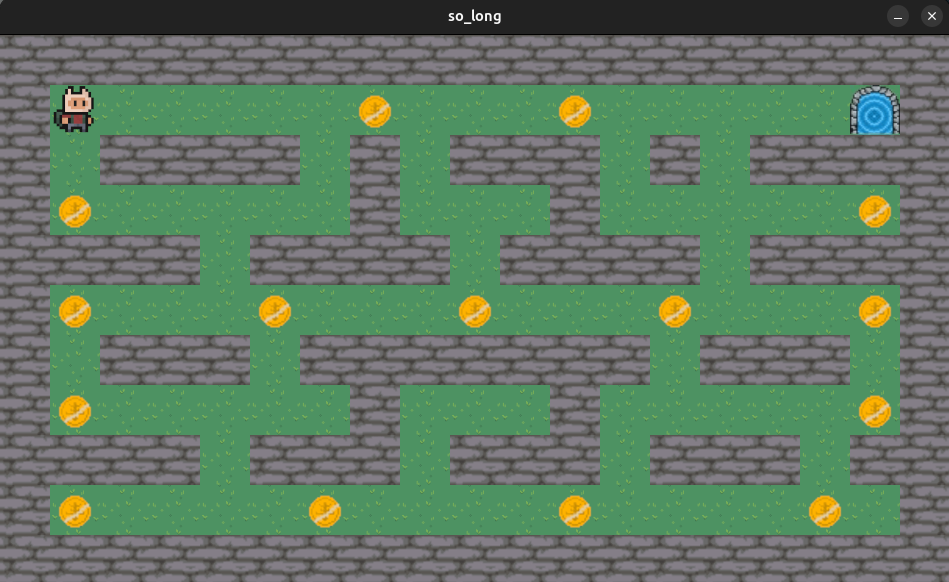

# so_long



This is a small game project from 42school implemented using MiniLibX.

## Goals
This project is a very small 2D game. It is built to make you work with textures, sprites. And some very basic gameplay elements.

## Getting Started
```
🚨 Please check that you have mlxlib installed in your machine.
```
### Install
```bash
$ make
```

### Usage
```bash
$ ./so_long [MAP_FILE.ber]
```
Only map files with extension `.ber` are available. Map file examples are available in the `maps/` directory.

```bash
$ ./so_long map.ber
```
Run the code to use all the features of the game.

### HOW TO PLAY
The player’s goal is to collect all collectibles present on the map then escape with minimal movement.

|KEYBOARD|ACTION|
|---|---|
|`W`, `↑`|Move up|
|`S`, `↓`|Move down|
|`A`, `←`|Move left|
|`D`, `→`|Move right|
|`ESC ⎋`|Close the game window|
